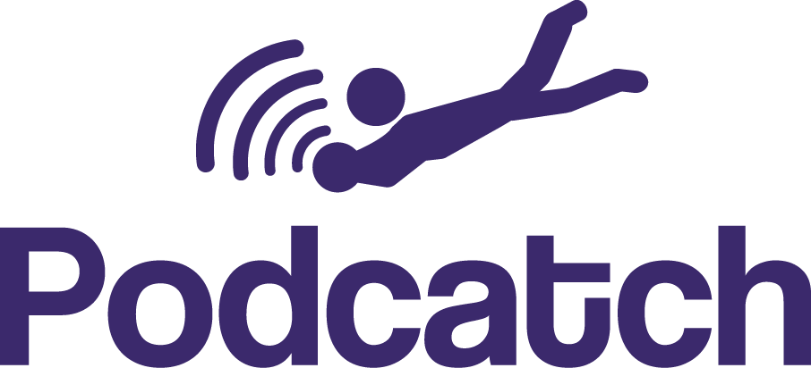

# Podcatch Web

A test client for Podcatch which runs independently of a server.

## Installation and Development
After cloning, simply run `npm install` to install the necessary modules.

Please also generate a firebase API key and create a file called apiKey.txt in src/scripts/ for the application to run successfully.

If you'll be working with any of the React components, run `webpack --watch` to transpile whilst working. When you're finished with your changes, run `gulp` to view your changes in the browser and share your tunnel link. Running these commands simultaneously in separate windows is recommended.

The only files you really need to edit are found in the `src` folder. The `docs` folder is separate and used for deployment.
